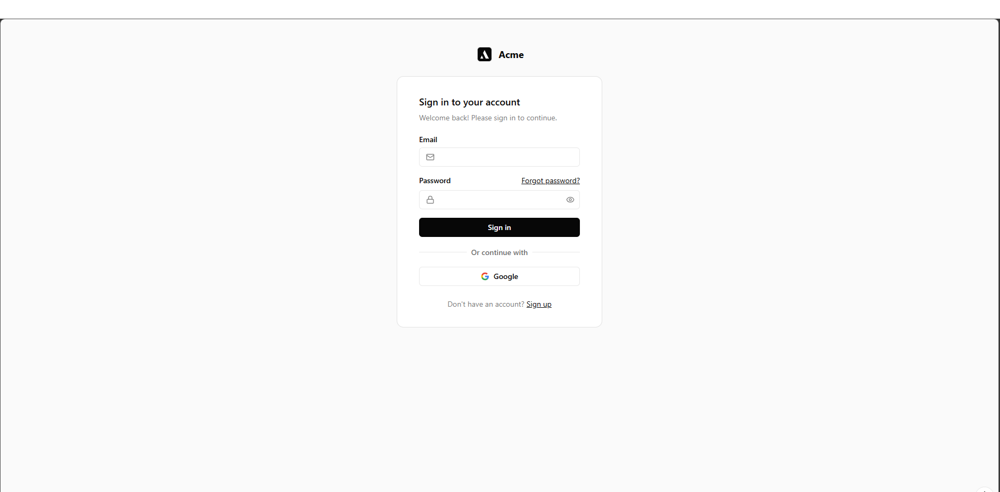
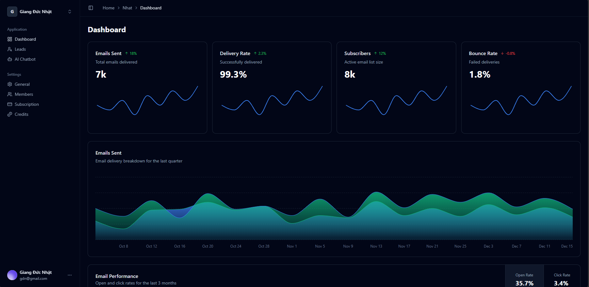

# Acme Analytics Dashboard - Frontend Development Demo

A modern, pixel-perfect, and responsive analytics dashboard built as a technical demonstration. This project focuses on high-quality UI/UX implementation, component-driven architecture, and seamless client-server integration within a tight 48-hour timeframe.

## Live Demo & Repository
- **Frontend Live (Vercel):** [https://dev-samurai-demo-frontend.vercel.app](https://dev-samurai-demo-frontend.vercel.app)
- **Backend API (DigitalOcean):** [https://coral-app-gim35.ondigitalocean.app](https://coral-app-gim35.ondigitalocean.app)
- **Backend Repository:** [https://github.com/ducnhat24/DevSamuraiDemoBackend](https://github.com/ducnhat24/DevSamuraiDemoBackend)

## Screenshots


| Login / Signup View | Main Dashboard View |
| :---: | :---: |
|  |  |


## Technology Stack
- **Framework:** React + Vite (TypeScript)
- **Styling:** Tailwind CSS v3
- **UI Components:** Shadcn UI + Radix UI (Headless)
- **State Management:** Redux Toolkit
- **Routing:** React Router DOM v6
- **Forms & Validation:** React Hook Form + Zod
- **API Client:** Axios
- **Charts:** Recharts

---

## Assumptions & Trade-offs

Building a production-like application in a short timeframe requires strategic decision-making. Here are the key technical trade-offs made:

1. **Redux Toolkit vs. TanStack Query (React Query):**
   - *Trade-off:* While TanStack Query is the modern standard for server-state management, I opted for Redux Toolkit + Axios.
   - *Reasoning:* Given the 48-hour sprint, Redux provided a stable, predictable global state for both authentication and user profiles without the overhead of restructuring the API layer. TanStack Query would be the primary candidate for future refactoring.
2. **Test-Readiness vs. Full Test Coverage:**
   - *Trade-off:* Due to time constraints, writing comprehensive Jest/React Testing Library suites was not feasible.
   - *Reasoning:* Instead of skipping testing entirely, I prioritized "Test-Readiness" by strategically placing `data-testid` attributes on key interactive elements (buttons, inputs, dropdowns). This demonstrates a QA-friendly mindset and prepares the codebase for immediate automation testing.
3. **Browser Support Assumption:**
   - Assumed the target audience uses modern browsers supporting advanced CSS features like `svh` (Small Viewport Height) for accurate mobile layouts and CSS pseudo-classes (`:has`).

---

## Setup Instructions (Local Development)

### 1. Prerequisites
- Node.js (v18 or higher)
- pnpm (Recommended)

### 2. Installation
Clone the repository and install dependencies:
```bash
git clone https://github.com/ducnhat24/devsamuraidemofrontend.git
pnpm install
```

### 3. Environment Configuration
Create a `.env` file in the root directory and add your backend API URL:
```env
VITE_API_URL=http://localhost:3000/api
```

### 4. Run the Development Server
```bash
pnpm dev
```
The application will be available at `http://localhost:5173`.

### 5. Build for Production
```bash
pnpm build
```
